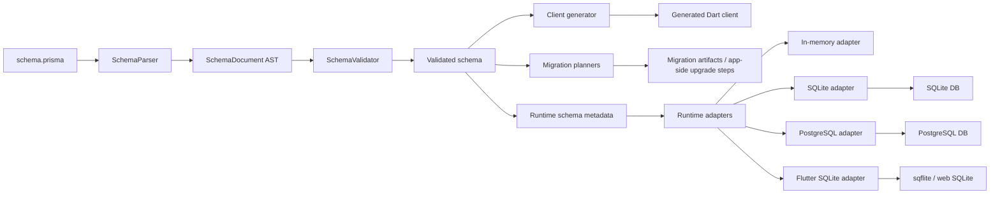

# Architecture

## High-Level Flow

## Layers

### Schema Layer

- `SchemaParser` turns source text into `SchemaDocument`
- `SchemaValidator` enforces supported DSL and provider-specific rules
- formatting and source regeneration also work from the same AST model

### Codegen Layer

- generated clients expose typed models, inputs, delegates, nested write helpers, and runtime metadata
- generated cursor selectors now feed the neutral query layer instead of doing full client-side slicing in delegate helpers

### Runtime Layer

- query models are provider-neutral
- adapters own execution strategy details such as SQL pushdown, cursor windows, and provider normalization
- generated clients sit above adapters and keep app-facing APIs typed and stable

### Migration Layer

- shared PostgreSQL/SQLite migration workflows live in VM-oriented packages
- migration artifacts store checksums, warnings, and before/after schema snapshots
- Flutter/device-local SQLite upgrades live in `comon_orm_sqlite_flutter` as explicit app-side migration code, including schema diff migrations through `SqliteFlutterMigration.schemaDiff(...)`

## Platform Split

- `packages/comon_orm`: parser, validator, codegen, shared query/runtime abstractions, web-safe migration artifact helpers
- `packages/comon_orm_postgresql`: PostgreSQL runtime, introspection, migration workflow
- `packages/comon_orm_sqlite`: VM-oriented SQLite runtime, introspection, migration workflow
- `packages/comon_orm_sqlite_flutter`: Flutter/mobile/desktop/web SQLite runtime and app-side local upgrade helpers